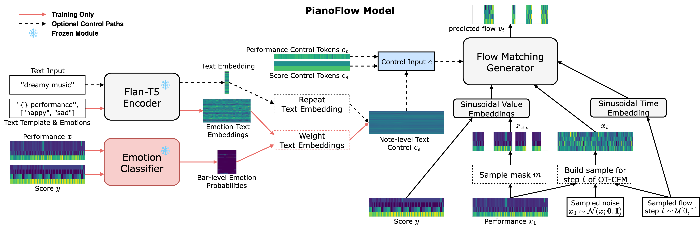

# SyMuPe: Affective and Controllable Symbolic Music Performance



> Official release for the paper [**"SyMuPe: Affective and Controllable Symbolic Music Performance"**](https://dl.acm.org/doi/10.1145/3746027.3755871)
> (**ACM MM 2025 Outstanding Paper Award**)
> 
> Proceedings of the [33rd ACM International Conference on Multimedia (ACM MM '25), Dublin, Ireland, 2025](https://acmmm2025.org/)
>
> Authors: Ilya Borovik, Dmitrii Gavrilev, and Vladimir Viro
>
> [](https://arxiv.org/abs/2511.03425)
> [](https://dl.acm.org/doi/10.1145/3746027.3755871)
> [](https://acmmm2025.org/awards/)
> [](https://ilya16.github.io/SyMuPe)
> [](https://huggingface.co/SyMuPe)
> [](https://huggingface.co/datasets/SyMuPe/PERiScoPe)
> [](LICENSE)

## Description

**SyMuPe** is a framework for creating controllable, transformer-based models for rendering symbolic music performances.

Its flagship model, **PianoFlow**, applies conditional flow matching to solve diverse multi-mask performance inpainting tasks.
By design, the model supports both **unconditional generation** and **infilling** of expressive performance features.

For more details, please refer to the [paper](https://arxiv.org/abs/2511.03425) and the [demo page](https://ilya16.github.io/SyMuPe) with samples.

## Models in the SyMuPe Framework

Score-only models described in the paper are available on the [Hugging Face Hub](https://huggingface.co/SyMuPe).

| Model Repo | Type                       | Objective | Description                                 |
|:---|:---------------------------|:---|:--------------------------------------------|
| [**PianoFlow-base**](https://huggingface.co/SyMuPe/PianoFlow-base) | Encoder Transformer | CFM | Flagship model for high-fidelity rendering  |
| [**EncDec-base**](https://huggingface.co/SyMuPe/EncDec-base) | Encoder-Decoder Transformer | CLM | Slower sequence-to-sequence baseline        |
| [**MLM-base**](https://huggingface.co/SyMuPe/MLM-base) | Encoder Transformer | MLM | Fast single-step language modeling baseline |
## Quick Start

Render an expressive performance from a quantized MIDI score in just a few lines of code.

```python
import torch
from symusic import Score

from symupe.data.tokenizers import SyMuPe
from symupe.inference import AutoGenerator, perform_score, save_performances
from symupe.models import AutoModel

device = torch.device("cuda" if torch.cuda.is_available() else "cpu")

# Load the model and tokenizer directly from the Hub
model_name = "SyMuPe/PianoFlow-base"
# model_name = "SyMuPe/EncDec-base"
# model_name = "SyMuPe/MLM-base"

model = AutoModel.from_pretrained(model_name).to(device)
tokenizer = SyMuPe.from_pretrained(model_name)

# Prepare generator for the model
generator = AutoGenerator.from_model(model, tokenizer, device=device)

# Load score MIDI
score_midi = Score("score.mid")

# Perform score MIDI (tokenization is handled inside)
gen_results = perform_score(
    generator=generator,
    score=score_midi,
    use_score_context=True,
    num_samples=8,
    seed=23
)
# gen_results[i] is PerformanceRenderingResult(...) containing:
# - score_midi, score_seq, gen_seq, perf_seq, perf_midi, perf_midi_sus

# Save performed MIDI files in a single directory
save_performances(gen_results, out_dir="samples")

```

## Dataset

The **PERiScoPe** (Piano Expression Refined Score and Performance MIDI) dataset used to train the models is available on [Hugging Face](https://huggingface.co/datasets/SyMuPe/PERiScoPe). 

## Citation

```bibtex
@inproceedings{borovik2025symupe,
  title = {{SyMuPe: Affective and Controllable Symbolic Music Performance}},
  author = {Borovik, Ilya and Gavrilev, Dmitrii and Viro, Vladimir},
  year = {2025},
  booktitle = {Proceedings of the 33rd ACM International Conference on Multimedia},
  pages = {10699--10708},
  doi = {10.1145/3746027.3755871}
}
```

## License

The materials in this repository are licensed under the
[Creative Commons Attribution–NonCommercial–ShareAlike 4.0 International License (CC BY-NC-SA 4.0)](LICENSE).
